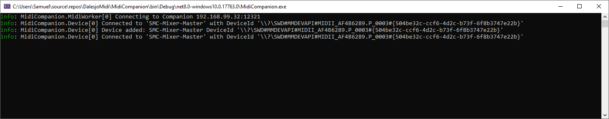

# MidiCompanion
This project enables allows us to use midi devices to controll an Bitfocus Companion which has OSC enabled. it allows the usage of rotary, faders and buttons.

## Setup
Configuration is done through appsettings.json you can follow the steps below to setup a device. 

# Bitfocus Companion
First, run the wizar for bitfocus and enable OSC. In appsettings.json fill in the ip number of companion and the port number.

# Connect Midi Device

Launch MidiCompanion.exe. it will list all midi devices and their DeviceID. Copy the deviceId and put it in your appsettings.json. Restart MidiCompanion.exe and it will not write out any keypress you do on your mididevice. You can now configure 3 different kinds of midi commands.



## Button
A button have two states, pressed and released. you specify which CC and Channel (1-16).
In the OSC section specify which Page/Row/column in companion that should be pressed.

Both the Pressed and release action will be trigged when pressing and releasing the button on the midi device.

```json
{
    "Midi": {
        "Channel": 1,
        "ControlChange": 52
    },
    "Osc": {
        "Page": 3,
        "Row": 2,
        "Column": 4
    }
}
```

## Rotary


```json
{
    "Midi": {
        "Channel": 1,
        "ControlChange": 33
    },
    "Osc": {
        "Page": 3,
        "Row": 0,
        "Column": 4
    }
}
```

## Faders

```json
{
    "Midi": {
        "Channel": 1,
        "ControlChange": 40,
        "Min": 0,
        "Max": 127
    },
    "Osc": {
        "Variable": "oscvalue",
        "Min": 0,
        "Max": 1,
        "Decimals": true,
        "Page": 3,
        "Row": 1,
        "Column": 4
    }
}
```

## Push
Push buttons jumps between step 1 and step 2 on OSC

```json
"Push": [
  {
    "Midi": {
      "Channel": 1,
      "ControlChange": 81
    },
    "Osc": {
      "Page": 3,
      "Row": 1,
      "Column": 3
    }
  }
]
```